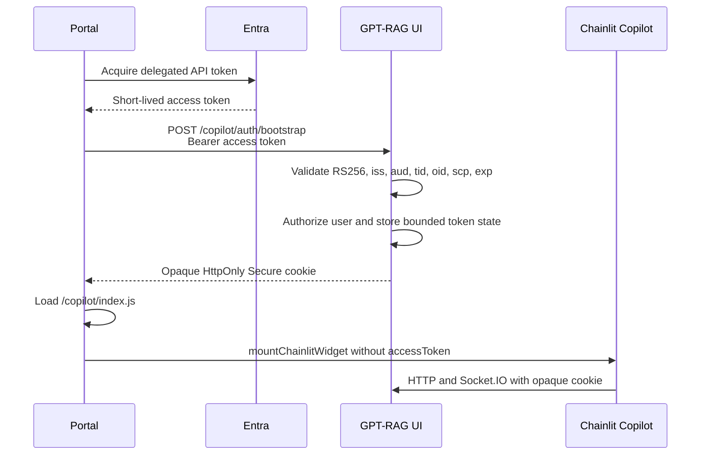

# Embed GPT-RAG with Chainlit Copilot

Chainlit Copilot can add GPT-RAG as a floating chat button and popover in an
external portal. Embedding is off by default. Enabling it adds a separate Entra
bootstrap policy without changing or bypassing the standalone OAuth policy.

Chainlit 2.9.4 mounts the widget in an open Shadow DOM in the portal document.
It does not use an iframe. GPT-RAG validates and supports only Chainlit's
built-in floating button and popover; other presentation modes are not
server-enforced and have not been validated.

## Security model

The portal acquires a short-lived Entra access token and sends it once to
`POST /copilot/auth/bootstrap`. GPT-RAG validates and authorizes the token,
stores it only in bounded server memory, and returns an opaque session cookie.
The cookie is `HttpOnly` and `Secure`; it contains no Entra or Chainlit token.
Its lifetime is the lesser of the configured Copilot TTL and the Entra `exp`.

Standalone OAuth credentials are also held only in bounded process memory.
The signed Chainlit authentication cookie contains a canonical profile and an
opaque server-side credential identifier, never an Entra access token or refresh
token. Persisted users and the `/user` response contain only the canonical
profile, with no credential identifier or authentication-source marker.

The Chainlit widget is mounted without `accessToken`. Subsequent HTTP,
Socket.IO polling, Socket.IO upgrade, and WebSocket requests must carry the
opaque cookie and an exact configured portal origin. Safe GET navigations such
as citation downloads, for which browsers omit `Origin`, must carry an exact
portal `Referer`.



## Configure the UI

Add these keys to Azure App Configuration with the `gpt-rag-ui` or `gpt-rag`
label. Container environment variables with the same names take precedence.

| Key | Required | Description |
| --- | --- | --- |
| `CHAINLIT_COPILOT_ENABLED` | Yes | Set to `true` to enable embedding. Default: `false`. |
| `CHAINLIT_AUTH_SECRET` | Yes | Persistent secret shared by the UI replicas for Chainlit sessions and signed download grants. Store it through a Key Vault-backed App Configuration reference. Copilot startup fails rather than generating a temporary value. |
| `CHAINLIT_URL` | Yes | Exact public HTTPS origin of the GPT-RAG UI, for example `https://chat.contoso.com`. Paths are not accepted. |
| `CHAINLIT_ALLOWED_ORIGINS` | Yes | Comma-separated portal origins, with a maximum of 20. Wildcards, paths, credentials, `null`, and non-local HTTP origins are rejected. Do not include `CHAINLIT_URL`; startup rejects overlap between the standalone and portal origins. |
| `CHAINLIT_COOKIE_SAMESITE` | No | `lax` by default. Accepted values are `lax`, `strict`, and `none`. Use `none` only when the portal and UI are cross-site; `strict` blocks cross-site bootstrap. The Copilot cookie is always `Secure`. |
| `CHAINLIT_COPILOT_ENTRA_TENANT_ID` | Yes | Tenant GUID accepted in `tid` and the exact v2 issuer. |
| `CHAINLIT_COPILOT_ENTRA_AUDIENCE` | Yes | Exact API audience expected in `aud`. |
| `CHAINLIT_COPILOT_ENTRA_REQUIRED_SCOPE` | No | One delegated scope name required in `scp`; spaces and multiple configured scope names are rejected. Default: `user_impersonation`. App-only tokens are rejected. |
| `CHAINLIT_COPILOT_SESSION_TTL_SECONDS` | No | Server-side session TTL from 60 to 86400 seconds. Default: 3600. Entra expiry can shorten it. |
| `CHAINLIT_COPILOT_MAX_SESSIONS` | No | Maximum in-memory Copilot sessions from 1 to 10000. Default: 1000. Only one opaque session is retained per `tid:oid`; replacement and capacity eviction disconnect associated sockets and cancel active tasks. |
| `CITATION_SHARED_DOWNLOAD_CONTAINERS` | No | Comma-separated storage containers whose contents have uniform access for every authorized UI user. Entries must also be one of the configured documents, images, or conversation-documents containers; other names have no effect. Default: empty. Never add permission-trimmed containers. |

When Copilot embedding is enabled, the standalone deployment must have OAuth
configured and `ALLOW_ANONYMOUS=false`. Copilot configuration never disables
OAuth, enables anonymous access, or converts an authentication failure into
anonymous chat. Invalid or incomplete enabled configuration fails startup.
Standalone development can still generate a temporary `CHAINLIT_AUTH_SECRET`
when embedding is disabled.

Restart the UI after changing startup settings.

## Portal bootstrap

Acquire the API token through the portal's existing MSAL flow, bootstrap the
server session, and only then load and mount the widget.

```html
<div id="gpt-rag-status" role="status">Loading assistant...</div>
<script>
  const chainlitServer = "https://chat.contoso.com";

  async function bootstrapAssistant(accessToken) {
    return fetch(`${chainlitServer}/copilot/auth/bootstrap`, {
      method: "POST",
      credentials: "include",
      headers: {
        Authorization: "Bearer " + accessToken,
      },
    });
  }

  async function loadCopilotBundle() {
    await new Promise((resolve, reject) => {
      const script = document.createElement("script");
      script.src = `${chainlitServer}/copilot/index.js`;
      script.onload = resolve;
      script.onerror = reject;
      document.head.appendChild(script);
    });
  }

  async function startAssistant() {
    const status = document.getElementById("gpt-rag-status");
    try {
      const token = await portalAuth.getGptRagAccessToken();
      let response = await bootstrapAssistant(token);

      if (response.status === 401) {
        const refreshed = await portalAuth.getGptRagAccessToken({ forceRefresh: true });
        response = await bootstrapAssistant(refreshed);
      }
      if (response.status === 403) {
        status.textContent =
          "You do not have access to this assistant. Contact your administrator.";
        return;
      }
      if (response.status === 429) {
        status.textContent = "Too many attempts. Try again shortly.";
        return;
      }
      if (response.status === 401) {
        status.textContent = "Your session expired. Sign in again.";
        return;
      }
      if (!response.ok) {
        status.textContent = "The assistant is temporarily unavailable. Try again.";
        return;
      }

      await loadCopilotBundle();
      window.mountChainlitWidget({
        chainlitServer,
        theme: "light",
      });
      status.remove();
    } catch {
      status.textContent = "The assistant is temporarily unavailable. Try again.";
    }
  }

  startAssistant();
</script>
```

An origin rejection is an operator configuration error. Do not retry it as a
sign-in failure, and never mount an anonymous widget after bootstrap fails.
The sample handles `429` because an approved gateway may rate-limit bootstrap;
the UI endpoint itself does not currently emit that status.

Successful bootstrap returns
`{"success": true, "expiresAt": <Unix timestamp>}`. The portal may use
`expiresAt` to schedule a complete stop, bootstrap, and remount before expiry.
Do not bootstrap silently behind a live widget: replacing the opaque session
disconnects its existing Socket.IO connections and cancels active tasks.

### Mid-session expiry

The opaque session can expire because its configured TTL or the Entra token
expires, because bounded state evicts the least-recently-used session, or because
the UI process restarts. The portal should treat an HTTP `401`, Socket.IO
authentication failure, or WebSocket `4401` as a signed-out assistant:

1. Unmount and remove the current widget.
2. Remove `chainlit-copilot-thread-id`.
3. Show a visible message such as "Your assistant session expired. Reconnecting..."
4. Acquire a fresh Entra token and call bootstrap once.
5. Mount a fresh widget only after bootstrap succeeds.

Do not reconnect indefinitely. After one failed refresh, show a sign-in action
or the appropriate access/unavailable message.

## Logout and account switching

The portal owns the complete widget lifecycle. Chainlit 2.9.4 does not fully
remove local widget state through its convenience globals, so clean it up
explicitly.

```js
async function stopAssistant() {
  try {
    await fetch(`${chainlitServer}/copilot/auth/logout`, {
      method: "POST",
      credentials: "include",
    });
  } finally {
    window.unmountChainlitWidget?.();
    document.getElementById("chainlit-copilot")?.remove();
    localStorage.removeItem("chainlit-copilot-thread-id");
  }
}
```

Unmounting tears down the widget's Socket.IO connection. On portal logout,
call `stopAssistant` and remain signed out. On account change:

1. Stop and remove the old widget.
2. Clear the old server session and local thread ID.
3. Acquire a token for the new account.
4. Bootstrap again.
5. Mount a fresh widget.

A successful bootstrap replaces any existing browser session. A cookie-less
bootstrap also replaces the existing session for the same `tid:oid`, so repeated
bootstrap cannot consume unbounded entries. Replacement, expiry, capacity
eviction, and logout disconnect associated sockets, cancel the active Chainlit
task, and reject further events from a surviving socket. A malformed token or
temporary JWKS failure preserves an otherwise valid current session. An
authorization denial, explicit logout, or failure without a valid prior session
clears the browser cookie.

Skipping the stop-and-clear sequence is not cosmetic: it can leave the old
account's locally rendered thread visible. Treat a widget that shows the wrong
account as a security incident, stop it immediately, and do not let the user
send another message until a clean bootstrap succeeds. The server rejects
Socket.IO restoration when the authenticated principal or opaque Copilot
session does not match the existing Chainlit session.

## Portal Content Security Policy

The portal's CSP governs the widget because the Shadow DOM is part of the
portal document. CSP returned by the GPT-RAG UI does not govern the portal.

- `script-src` must permit the GPT-RAG UI origin.
- `connect-src` must permit the UI HTTPS and WSS origins.
- `style-src 'unsafe-inline'` is required by Chainlit 2.9.4 for styles injected
  into the Shadow DOM.
- If no custom font is configured, the bundle loads Google Inter. Permit the
  required Google style/font origins or configure an approved self-hosted font.
- `frame-src` is not required for this widget.

Account switching injects the external bundle again. With a nonce-based portal
CSP, the newly created script element must receive a fresh valid nonce just as
it did on the initial load.

## Exact-origin and download behavior

- Portal browser traffic is accepted only from exact
  `CHAINLIT_ALLOWED_ORIGINS` values.
- The standalone UI origin comes from exact `CHAINLIT_URL` and retains its
  existing OAuth policy.
- Requests with an unlisted `Origin` are rejected before Chainlit handles
  them. A Copilot cookie is honored only with an exact portal `Origin` or
  safe-GET `Referer`; otherwise it is ignored so it cannot override standalone
  OAuth handling.
- `/auth/jwt` and `/auth/header` are unavailable to portal origins. The portal
  uses only the dedicated bootstrap endpoint.
- Copilot citation URLs are absolute URLs on `CHAINLIT_URL`. They contain a
  short-lived, signed grant bound to the authenticated principal, conversation,
  container, and blob. The server rechecks the session and conversation
  ownership before streaming the file. Conversation uploads must be under
  `conversations/<owned-conversation-id>/`. Other containers are default-denied
  unless explicitly listed in `CITATION_SHARED_DOWNLOAD_CONTAINERS`, which is
  safe only for corpora with uniform access for every authorized UI user.
  Shared entries must also match the configured documents, images, or
  conversation-documents container; arbitrary additional container names are
  not admitted.
  Permission-trimmed containers require a future document-level authorization
  integration and must not be listed. Unauthorized citations render as text
  without a link. Direct SAS and public-blob fallbacks are not used for Copilot.
- Standalone sessions retain the pre-existing SAS citation generation and
  `/api/download/<container>/<path>` behavior. This remains true when Copilot is
  disabled or when an authenticated standalone OAuth session uses an instance
  where Copilot is enabled. Copilot and unauthenticated sessions on an enabled
  instance cannot use the legacy container download route. When Copilot is
  disabled, this compatibility path retains the existing bearer-SAS and route
  access model; do not enable anonymous standalone access for restricted
  corpora.
- Users are identified as `tid:oid`. Tokens without both claims are rejected,
  and thread ownership is checked before list/get/resume/rename/delete,
  feedback, and download operations.
- Prefer lowercase `tid:oid` values in `ALLOWED_USER_PRINCIPALS`. Bare `oid`
  entries remain accepted for compatibility with the orchestrator's existing
  allow-list contract.
- Chainlit users and thread authors are bound to `tid:oid`. The current
  orchestrator conversation endpoints are bearer-token scoped but persist a
  bare `oid`; GPT-RAG canonicalizes the Chainlit owner with the validated
  token's `tid` and rejects conflicting tenants. A future multi-tenant
  orchestrator must persist `tid:oid` before this compatibility path can be
  removed.

## Browser bridge restrictions

Copilot sessions default-deny Chainlit `call_fn` and `window_message` in both
directions. Do not send credentials, tokens, customer data, or authorization
decisions through browser bridge features.

Chainlit 2.9.4 still exposes browser globals such as
`mountChainlitWidget`, `unmountChainlitWidget`, `toggleChainlitCopilot`,
`sendChainlitMessage`, thread access helpers, the shadow-root reference, and
theme state. Any script already running in the portal can call these globals;
they are convenience APIs, not authorization boundaries.

The pinned bundle also contains non-configurable
`window.parent.postMessage(..., "*")` behavior for `window_message`, and
dispatches `chainlit-call-fn` on `window` when `call_fn` is used. GPT-RAG blocks
those server events for Copilot sessions, but the wildcard/browser-global code
remains present in the third-party bundle. Reassess this limitation when
upgrading Chainlit.

## Accessibility and browser validation

GPT-RAG does not implement the Copilot user interface. The floating button,
popover, controls, keyboard behavior, focus handling, ARIA, styling, and
responsive layout are inherited from pinned Chainlit 2.9.4. GPT-RAG adds
server-side authentication, session, origin, ownership, and download controls
only.

Do not treat the embedded widget as accessibility certified. In Chainlit 2.9.4:

- Basic button, dialog, focus, and Escape handling is present, but complete
  keyboard order, initial focus, focus containment, and focus restoration have
  not been validated in a portal.
- The default launcher and expand or collapse control lack explicit accessible
  names. Dialog naming, streaming-response announcements, reading order, and
  error announcements remain unvalidated with screen readers.
- Reflow at 200% zoom and Windows high-contrast or forced-colors modes has not
  been validated. The bundle has no widget-specific forced-colors treatment.
- The floating launcher is 64 by 64 CSS pixels, and the popover uses responsive
  viewport sizing, but touch targets, mobile scrolling, safe areas, orientation
  changes, and the on-screen keyboard remain unvalidated.
- Portal styles outside the Shadow DOM cannot be assumed to fix widget content.
  The example configuration does not load a `customCssUrl`.

The portal owner is responsible for the accessibility of the combined portal
and widget. This includes visible loading and failure states, accessible control
names, logical focus before and after mount, unmount, expiry, and account
switching, sufficient theme contrast, non-overlap with portal controls, and an
accessible fallback such as a link to the standalone GPT-RAG UI.

Before production release, validate the deployed widget inside the actual
portal, not only the standalone UI. At minimum, validate:

- Keyboard-only operation in current Edge and Chrome on Windows, including
  opening, sending, new chat, expand or collapse, closing with Escape, and focus
  return.
- NVDA with Edge, plus other screen readers required by the organization.
- Safari with VoiceOver when macOS or iOS is supported.
- Chrome with TalkBack when Android is supported.
- 200% browser zoom and Windows high-contrast mode.
- Touch operation in portrait and landscape, including the software keyboard
  and scrolling.
- Bootstrap failure, session expiry, logout, and account switching in each
  supported browser.

Record results and approved exceptions. Repeat this validation after a Chainlit
upgrade or changes to the portal shell, theme, widget configuration, or custom
CSS.

## Deployment limitation

The bounded Copilot session state and standalone OAuth credential state are
process-local.

- One UI replica is the supported safe default.
- Multiple replicas require session affinity covering bootstrap, HTTP,
  Socket.IO polling, Socket.IO upgrade, and WebSocket traffic.
- Restart, revision replacement, node loss, eviction, or affinity loss signs
  affected users out.
- Each opaque session accepts at most four concurrent physical Socket.IO
  connections. Restoring a Chainlit session explicitly disconnects its
  superseded transport before admitting the replacement. Additional physical
  connections are rejected; this limit is not configurable.
- Affinity is not high availability. Resilient scale-out requires a shared,
  encrypted server-side session store in a future change.

This repository does not enforce replica counts. Confirm that the hosting
configuration keeps both minimum and maximum UI replicas at `1`, or configure
affinity for every path listed above. Also verify that `CHAINLIT_URL` is the
externally visible UI origin after gateway/proxy rewriting; it is used to mint
absolute citation URLs.

Prefer publishing the portal and UI through the approved Zero Trust gateway or
front door. Do not expose the Container App directly.

## Troubleshooting

| Symptom | Check |
| --- | --- |
| Bootstrap 403 | The browser `Origin` exactly matches `CHAINLIT_ALLOWED_ORIGINS`, including scheme and port. |
| Bootstrap 401 | Token issuer, audience, tenant, `oid`, delegated scope, signature, and expiry. Reacquire once. |
| Bootstrap 503 | Entra JWKS could not be reached. Show the unavailable state; do not start a sign-in loop. |
| Widget reports authentication failure | Bootstrap completed before mounting and the request used `credentials: "include"`. |
| Cookie absent | HTTPS is used; for cross-site portals use `SameSite=None`; check browser third-party-cookie policy. |
| CSP blocks the widget | Portal `script-src`, `connect-src`, `style-src`, and font rules include the required sources. |
| Socket.IO 403 or WebSocket 1008/4401 | Exact origin, cookie delivery, session affinity, and server session expiry. |
| Citation returns 404 | Session is current, the conversation belongs to the user, the signed grant is unmodified, and the blob exists. |
| Account switch shows an old thread | Call Copilot logout, unmount, remove `#chainlit-copilot`, and remove `chainlit-copilot-thread-id` before bootstrap. |
| Widget shows the wrong account | Stop the widget immediately, clear it as above, and bootstrap again. Do not allow another send while stale account content is visible. |

For direct citation navigation, do not configure the portal with
`Referrer-Policy: no-referrer`; browsers normally omit `Origin` on that GET, so
the UI requires an exact allowed portal `Referer`. A portal can instead perform
an authenticated fetch that supplies its browser-managed `Origin`.

## Residual Chainlit 2.9.4 limitations

- The standalone page continues to use Chainlit's built-in OAuth flow and signed
  authentication cookie, but GPT-RAG keeps the resulting access and refresh
  tokens in a bounded process-local store rather than in that cookie or the
  persisted Chainlit user.
- Socket and browser bridge guards patch pinned Chainlit 2.9.4 internals because
  that release has no supported policy hook for them. Revalidate all guards
  before upgrading Chainlit.
- Browser globals, the open Shadow DOM reference, and the wildcard
  `postMessage` code remain present in the downloaded third-party bundle even
  though GPT-RAG blocks the corresponding server bridge events.
- Cross-site operation still depends on the target browser accepting the
  `SameSite=None; Secure` cookie. There is no safe application fallback when
  third-party cookies are blocked.
