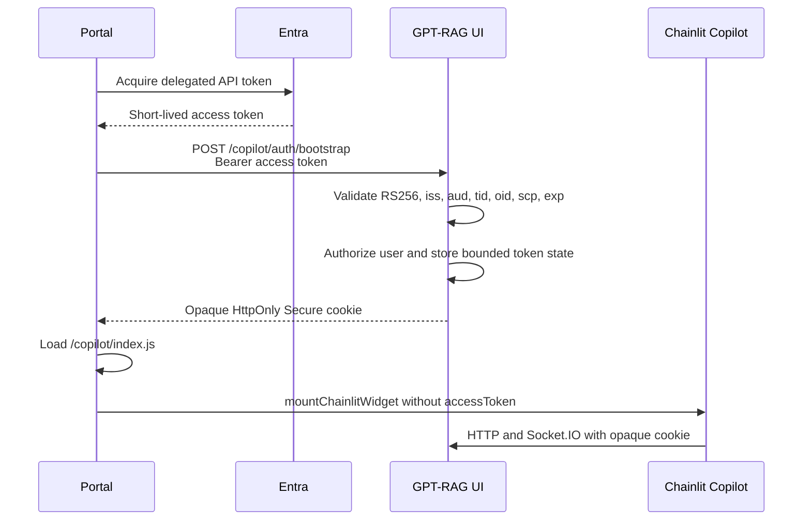

# Embed GPT-RAG with Chainlit Copilot

Chainlit Copilot can add GPT-RAG as a floating chat button and popover in an
external portal. Embedding is off by default. Enabling it adds a separate Entra
bootstrap policy without changing or bypassing the standalone OAuth policy.

Chainlit 2.9.4 mounts the widget in an open Shadow DOM in the portal document.
It does not use an iframe. GPT-RAG validates and supports only Chainlit's
built-in floating button and popover; other presentation modes are not
server-enforced and have not been validated.

## Security model

The portal acquires a short-lived Entra access token and sends it once to
`POST /copilot/auth/bootstrap`. GPT-RAG validates and authorizes the token,
stores it only in bounded server memory, and returns an opaque session cookie.
The cookie is `HttpOnly` and `Secure`; it contains no Entra or Chainlit token.
Its lifetime is the lesser of the configured Copilot TTL and the Entra `exp`.

The Chainlit widget is mounted without `accessToken`. Subsequent HTTP,
Socket.IO polling, Socket.IO upgrade, and WebSocket requests must carry the
opaque cookie and an exact configured portal origin. Top-level citation
navigation normally omits `Origin`; the dedicated download endpoint resolves
the opaque cookie directly and repeats principal, conversation, container, and
path authorization. `Referer` is never an authentication or authorization
input.



## Configure the UI

Add these keys to Azure App Configuration with the `gpt-rag-ui` or `gpt-rag`
label. Container environment variables with the same names take precedence.

| Key | Required | Description |
| --- | --- | --- |
| `CHAINLIT_COPILOT_ENABLED` | Yes | Set to `true` to enable embedding. Default: `false`. |
| `CHAINLIT_AUTH_SECRET` | Yes | Persistent secret shared by the UI replicas for Chainlit sessions and signed download grants. It must contain at least 32 UTF-8 bytes. Use a random value with at least 256 bits of entropy and store it through a Key Vault-backed App Configuration reference. Copilot startup fails rather than generating a temporary value. |
| `CHAINLIT_URL` | Yes | Exact public HTTPS origin of the GPT-RAG UI, for example `https://chat.contoso.com`. Paths are not accepted. |
| `CHAINLIT_ALLOWED_ORIGINS` | Yes | Comma-separated portal origins, with at most 20 explicit entries. The portal origins must be distinct from `CHAINLIT_URL`. Wildcards, paths, credentials, `null`, and non-local HTTP origins are rejected. |
| `CHAINLIT_COOKIE_SAMESITE` | No | `lax` by default. Use `none` only when the portal and UI are cross-site. The Copilot cookie is always `Secure`. |
| `CHAINLIT_COPILOT_ENTRA_TENANT_ID` | Yes | Tenant GUID accepted in `tid` and the exact v2 issuer. |
| `CHAINLIT_COPILOT_ENTRA_AUDIENCE` | Yes | Exact API audience expected in `aud`. |
| `CHAINLIT_COPILOT_ENTRA_REQUIRED_SCOPE` | No | Delegated scope required in `scp`. Default: `user_impersonation`. App-only tokens are rejected. |
| `CHAINLIT_COPILOT_SESSION_TTL_SECONDS` | No | Server-side session TTL from 60 to 86400 seconds. Default: 3600. Entra expiry can shorten it. |
| `CHAINLIT_COPILOT_MAX_SESSIONS` | No | Maximum in-memory Copilot sessions from 1 to 10000. Default: 1000. The least recently used session is evicted at capacity. |
| `CHAINLIT_COPILOT_BOOTSTRAP_RATE_LIMIT_PER_MINUTE` | No | Process-local bootstrap attempt limit per direct peer and exact origin, from 1 to 600. Default: 60. Returns `429` with `Retry-After`. This is defense in depth, not a replacement for trusted-ingress throttling. |
| `CITATION_SHARED_DOWNLOAD_CONTAINERS` | No | Comma-separated configured document or image containers whose contents have uniform access for every authorized UI user. Default: empty. Values must match `DOCUMENTS_STORAGE_CONTAINER` or `DOCUMENTS_IMAGES_STORAGE_CONTAINER`; this setting cannot introduce another container. The conversation-upload container remains conversation-bound. Never add permission-trimmed containers. |

The standalone deployment must have OAuth configured and
`ALLOW_ANONYMOUS=false`. Copilot configuration never disables OAuth, enables
anonymous access, or converts an authentication failure into anonymous chat.
Invalid or incomplete enabled configuration fails startup.
Standalone development can still generate a temporary `CHAINLIT_AUTH_SECRET`
when embedding is disabled.

Restart the UI after changing startup settings.
Rotating `CHAINLIT_AUTH_SECRET` also requires a restart and signs out current
users. Existing Chainlit tokens and one-hour citation grants signed with the
previous value stop validating.

If both `ALLOWED_USER_PRINCIPALS` and `ALLOWED_USER_NAMES` are empty, every
valid delegated user in the configured tenant is authorized. Treat that as an
explicit deployment decision and record security-owner sign-off.

## Portal bootstrap

Acquire the API token through the portal's existing MSAL flow, bootstrap the
server session, and only then load and mount the widget.

```html
<div id="gpt-rag-status" role="status">Loading assistant...</div>
<script>
  const chainlitServer = "https://chat.contoso.com";
  let sessionExpiryTimer;

  async function bootstrapAssistant(accessToken) {
    return fetch(`${chainlitServer}/copilot/auth/bootstrap`, {
      method: "POST",
      credentials: "include",
      headers: {
        Authorization: "Bearer " + accessToken,
      },
    });
  }

  function removeAssistantUi() {
    clearTimeout(sessionExpiryTimer);
    window.unmountChainlitWidget?.();
    document.getElementById("chainlit-copilot")?.remove();
    localStorage.removeItem("chainlit-copilot-thread-id");
  }

  async function clearServerSession() {
    await fetch(`${chainlitServer}/copilot/auth/logout`, {
      method: "POST",
      credentials: "include",
    });
  }

  async function stopAssistant() {
    // Remove stale content before waiting for a network request.
    removeAssistantUi();
    try {
      await clearServerSession();
    } catch {
      // The local UI is already gone. The bounded server session will expire.
    }
  }

  async function loadCopilotBundle() {
    if (typeof window.mountChainlitWidget === "function") return;
    await new Promise((resolve, reject) => {
      const script = document.createElement("script");
      script.src = `${chainlitServer}/copilot/index.js`;
      script.onload = resolve;
      script.onerror = reject;
      document.head.appendChild(script);
    });
  }

  async function verifySessionCookie() {
    return fetch(`${chainlitServer}/project/settings`, {
      method: "GET",
      credentials: "include",
    });
  }

  function scheduleRefresh(expiresAt) {
    const expiryMilliseconds = Number(expiresAt) * 1000;
    if (!Number.isFinite(expiryMilliseconds)) return;
    const refreshDelay = Math.max(
      0,
      expiryMilliseconds - Date.now() - 30_000,
    );
    sessionExpiryTimer = setTimeout(() => {
      void restartAssistant();
    }, refreshDelay);
  }

  async function startAssistant({ forceRefresh = false } = {}) {
    const status = document.getElementById("gpt-rag-status");
    let serverSessionCreated = false;
    status.hidden = false;
    status.textContent = "Loading assistant...";
    try {
      const token = await portalAuth.getGptRagAccessToken({ forceRefresh });
      let response = await bootstrapAssistant(token);

      if (response.status === 401) {
        const refreshed = await portalAuth.getGptRagAccessToken({ forceRefresh: true });
        response = await bootstrapAssistant(refreshed);
      }
      if (response.status === 403) {
        status.textContent =
          "You do not have access to this assistant. Contact your administrator.";
        return;
      }
      if (response.status === 429) {
        status.textContent = "Too many attempts. Try again shortly.";
        return;
      }
      if (response.status === 401) {
        status.textContent = "Your session expired. Sign in again.";
        return;
      }
      if (!response.ok) {
        status.textContent = "The assistant is temporarily unavailable. Try again.";
        return;
      }

      const session = await response.json();
      serverSessionCreated = true;
      const probe = await verifySessionCookie();
      if (!probe.ok) {
        throw new Error("The browser did not establish the assistant cookie.");
      }

      await loadCopilotBundle();
      if (typeof window.mountChainlitWidget !== "function") {
        throw new Error("The Chainlit Copilot bundle did not initialize.");
      }
      window.mountChainlitWidget({
        chainlitServer,
        theme: "light",
      });
      scheduleRefresh(session.expiresAt);
      status.hidden = true;
    } catch {
      // If bootstrap succeeded but probe, bundle loading, or mounting failed,
      // remove local state first and then revoke the server session.
      removeAssistantUi();
      if (serverSessionCreated) {
        try {
          await clearServerSession();
        } catch {}
      }
      status.hidden = false;
      status.textContent = "The assistant is temporarily unavailable. Try again.";
    }
  }

  async function restartAssistant() {
    await stopAssistant();
    await startAssistant({ forceRefresh: true });
  }

  startAssistant();
</script>
```

An origin rejection is an operator configuration error. A portal whose origin
is not allow-listed normally sees a browser CORS/network error rather than a
readable `403`; a configured origin can read a `403` authorization denial. Do
not retry either case as a sign-in failure, and never mount an anonymous widget
after bootstrap fails.
The UI emits `429` with `Retry-After` when its process-local bootstrap limit is
reached. Honor that delay. Configure authoritative distributed throttling at
Front Door WAF, API Management, or another trusted gateway because clients can
change source paths and requests can be spread across replicas.

If the second `401` remains after the one forced token refresh, the refreshed
credential still did not establish an acceptable delegated session. Stop the
loop and require an explicit sign-in. If bootstrap succeeds but the widget's
first authenticated request fails, investigate cookie delivery separately;
cross-site cookie blocking is not fixed by refreshing the Entra token.
The sample probes `/project/settings` because a bootstrap `200` confirms that
the server emitted `Set-Cookie`, not that the browser accepted it.

### Mid-session expiry

Use bootstrap's Unix-seconds `expiresAt` value to refresh before expected
expiry. The opaque session can also disappear because its configured TTL or the Entra token
expires, because bounded state evicts an inactive session, or because the UI
process restarts. The portal should treat an HTTP `401`, Socket.IO
authentication failure, or WebSocket `4401` as a signed-out assistant:

1. Unmount and remove the current widget.
2. Remove `chainlit-copilot-thread-id`.
3. Show a visible message such as "Your assistant session expired. Reconnecting..."
4. Acquire a fresh Entra token and call bootstrap once.
5. Mount a fresh widget only after bootstrap succeeds.

Do not reconnect indefinitely. After one failed refresh, show a sign-in action
or the appropriate access/unavailable message.

Chainlit 2.9.4 exposes no reliable host callback for every Socket.IO loss,
eviction, or affinity failure. Proactive `expiresAt` refresh covers planned
expiry only. Qualify any automatic-recovery claim, and make the widget's own
authentication failure visible when the host cannot observe it.

## Logout and account switching

The portal owns the complete widget lifecycle. Chainlit 2.9.4 does not fully
remove local widget state through its convenience globals, so clean it up
explicitly.

```js
async function stopAssistant() {
  window.unmountChainlitWidget?.();
  document.getElementById("chainlit-copilot")?.remove();
  localStorage.removeItem("chainlit-copilot-thread-id");
  try {
    await fetch(`${chainlitServer}/copilot/auth/logout`, {
      method: "POST",
      credentials: "include",
    });
  } catch {}
}
```

Unmounting tears down the widget's Socket.IO connection. On portal logout,
call `stopAssistant` and remain signed out. On account change:

1. Stop and remove the old widget.
2. Clear the old server session and local thread ID.
3. Acquire a token for the new account.
4. Bootstrap again.
5. Mount a fresh widget.

A successful bootstrap atomically replaces and disconnects any existing
Copilot server session, so a different account cannot inherit the previous
principal's state. A malformed token or temporary JWKS failure does not destroy
an otherwise valid current session. An explicit logout or an authorization
denial clears it.

Skipping the stop-and-clear sequence is not cosmetic: it can leave the old
account's locally rendered thread visible. Treat a widget that shows the wrong
account as a security incident, stop it immediately, and do not let the user
send another message until a clean bootstrap succeeds. The server rejects
Socket.IO restoration when the authenticated principal or opaque Copilot
session does not match the existing Chainlit session.

All tabs on the same browser profile share the UI cookie, and portal tabs on
the same origin also share `chainlit-copilot-thread-id`. A successful bootstrap
in one tab replaces the server session and disconnects the other tabs. Do not
support concurrent accounts in separate tabs. Coordinate lifecycle changes
with `BroadcastChannel` or an equivalent portal-owned mechanism if multiple
tabs are expected.

## Portal Content Security Policy

The portal's CSP governs the widget because the Shadow DOM is part of the
portal document. CSP returned by the GPT-RAG UI does not govern the portal.

- `script-src` must permit the GPT-RAG UI origin.
- `connect-src` must permit the UI HTTPS and WSS origins.
- `style-src 'unsafe-inline'` is required by Chainlit 2.9.4 for styles injected
  into the Shadow DOM.
- If no custom font is configured, the bundle loads Google Inter. Permit the
  required Google style/font origins or configure an approved self-hosted font.
- `frame-src` is not required for this widget.

Account switching injects the external bundle again. With a nonce-based portal
CSP, the newly created script element must receive a fresh valid nonce just as
it did on the initial load.

## Exact-origin and download behavior

- Portal browser traffic is accepted only from exact
  `CHAINLIT_ALLOWED_ORIGINS` values. The UI and portal must use distinct
  origins, and at most 20 portal origins can be configured.
- The standalone UI origin comes from exact `CHAINLIT_URL` and retains its
  existing OAuth policy.
- Requests with an unlisted `Origin` are rejected before Chainlit handles
  them. A Copilot cookie is honored by the Chainlit request pipeline only with
  an exact portal `Origin`; otherwise it is ignored so it cannot override
  standalone OAuth handling. The dedicated top-level download route is the sole
  no-`Origin` exception and resolves only the opaque cookie before repeating
  all download authorization checks. `Referer` is ignored.
- `/auth/jwt` and `/auth/header` are unavailable to portal origins. The portal
  uses only the dedicated bootstrap endpoint.
- Citation URLs are absolute URLs on `CHAINLIT_URL`. They contain a short-lived,
  signed grant bound to the authenticated principal, conversation, container,
  and blob. The server rechecks the session and conversation ownership before
  streaming the blob in chunks. Grants expire after 3,600 seconds and secret
  rotation invalidates them. Conversation IDs must be canonical UUIDs.
  Conversation uploads must be under
  `conversations/<owned-conversation-id>/`. Other containers are default-denied
  unless the configured document or image container is explicitly listed in
  `CITATION_SHARED_DOWNLOAD_CONTAINERS`, which is safe only for corpora with
  uniform access for every authorized UI user. Listing another container name
  has no effect, and the conversation-upload container always remains
  conversation-bound.
  Permission-trimmed containers require a future document-level authorization
  integration and must not be listed. Unauthorized citations render as text
  without a link. Direct SAS and public-blob fallbacks are not used.
- Users are identified as `tid:oid`. Tokens without both claims are rejected,
  and thread ownership is checked before list/get/resume/rename/delete,
  feedback, and download operations.
- Prefer lowercase `tid:oid` values in `ALLOWED_USER_PRINCIPALS`. Bare `oid`
  entries remain accepted for compatibility with the orchestrator's existing
  allow-list contract.
- Chainlit users and thread authors are bound to `tid:oid`. The current
  orchestrator conversation endpoints are bearer-token scoped but persist a
  bare `oid`; GPT-RAG canonicalizes the Chainlit owner with the validated
  token's `tid` and rejects conflicting tenants. A future multi-tenant
  orchestrator must persist `tid:oid` before this compatibility path can be
  removed.

## Browser bridge restrictions

Copilot sessions default-deny Chainlit `call_fn` and `window_message` in both
directions. Do not send credentials, tokens, customer data, or authorization
decisions through browser bridge features.

Chainlit 2.9.4 still exposes browser globals such as
`mountChainlitWidget`, `unmountChainlitWidget`, `toggleChainlitCopilot`,
`sendChainlitMessage`, thread access helpers, the shadow-root reference, and
theme state. Any script already running in the portal can call these globals;
they are convenience APIs, not authorization boundaries.

The pinned bundle also contains non-configurable
`window.parent.postMessage(..., "*")` behavior for `window_message`, and
dispatches `chainlit-call-fn` on `window` when `call_fn` is used. GPT-RAG blocks
those server events for Copilot sessions, but the wildcard/browser-global code
remains present in the third-party bundle. Reassess this limitation when
upgrading Chainlit.

## Deployment limitation

The bounded Copilot session and Entra token state is process-local.

- One UI replica is the supported safe default.
- Multiple replicas require session affinity covering bootstrap, HTTP,
  Socket.IO polling, Socket.IO upgrade, and WebSocket traffic.
- Restart, revision replacement, node loss, eviction, or affinity loss signs
  affected users out.
- Affinity is not high availability. Resilient scale-out requires a shared,
  encrypted server-side session store in a future change.

This repository does not enforce replica counts. For Azure Container Apps, use
single-revision mode, keep both minimum and maximum UI replicas at `1` for that
revision, and do not split traffic across revisions. `minReplicas=1` and
`maxReplicas=1` apply per revision and are not sufficient when multiple
revisions receive traffic. A revision switch still loses process-local sessions
and signs users out. If scaling out, verify affinity for every path listed above
instead of assuming gateway cookie affinity also pins the backend replica. Also
verify that `CHAINLIT_URL` is the externally visible UI origin after
gateway/proxy rewriting; it is used to mint absolute citation URLs.

Prefer publishing the portal and UI through the approved Zero Trust gateway or
front door. Do not expose the Container App directly.

The bootstrap limiter is also process-local and keys a fixed 60-second window
by a SHA-256 digest of the direct peer plus exact `Origin`. It retains only a
bounded number of digests. Peer identity is meaningful only when the UI is
reached through a trusted ingress; do not trust client-supplied forwarding
headers in the application. Behind an ingress, many users can share one direct
peer bucket, so tune the local limit for aggregate bursts. Enforce authoritative
per-user or per-client rate limits at that ingress.

## Troubleshooting

| Symptom | Check |
| --- | --- |
| Bootstrap 403 | The browser `Origin` exactly matches `CHAINLIT_ALLOWED_ORIGINS`, including scheme and port. |
| Bootstrap appears as a CORS/network error | The portal origin is not listed, is malformed, or the request bypassed the approved ingress. Unlisted origins cannot read the UI's `403`. |
| Bootstrap 401 | Token issuer, audience, tenant, `oid`, delegated scope, signature, and expiry. Reacquire once. |
| Bootstrap 429 | Honor `Retry-After`, stop automatic retries, and inspect trusted-ingress limits if the condition persists. |
| Bootstrap 503 | Entra JWKS could not be reached. Show the unavailable state; do not start a sign-in loop. |
| Widget reports authentication failure | Bootstrap completed before mounting and the request used `credentials: "include"`. |
| Cookie absent after successful bootstrap | HTTPS is used; for cross-site portals use `SameSite=None`; check browser third-party-cookie policy. This is distinct from token verification failure. |
| CSP blocks the widget | Portal `script-src`, `connect-src`, `style-src`, and font rules include the required sources. |
| Socket.IO 403 or WebSocket 1008/4401 | Exact origin, cookie delivery, session affinity, and server session expiry. |
| Citation returns 404 | Session is current, the conversation belongs to the user, the signed grant is unmodified, and the blob exists. |
| Account switch shows an old thread | Call Copilot logout, unmount, remove `#chainlit-copilot`, and remove `chainlit-copilot-thread-id` before bootstrap. |
| Widget shows the wrong account | Stop the widget immediately, clear it as above, and bootstrap again. Do not allow another send while stale account content is visible. |

## Residual Chainlit 2.9.4 limitations

- The standalone page continues to use Chainlit's built-in OAuth and session
  mechanism. The bounded opaque-cookie store described here applies only to
  Copilot sessions.
- Socket and browser bridge guards patch pinned Chainlit 2.9.4 internals because
  that release has no supported policy hook for them. Revalidate all guards
  before upgrading Chainlit.
- Browser globals, the open Shadow DOM reference, and the wildcard
  `postMessage` code remain present in the downloaded third-party bundle even
  though GPT-RAG blocks the corresponding server bridge events.
- Cross-site operation still depends on the target browser accepting the
  `SameSite=None; Secure` cookie. There is no safe application fallback when
  third-party cookies are blocked.
- One browser profile and portal origin cannot maintain independent Copilot
  accounts across tabs because the opaque cookie and thread key are shared.
- Shared citation containers are all-or-nothing. Leave them unlisted to render
  citations as plain text unless every authorized UI user may download every
  blob in the container.
