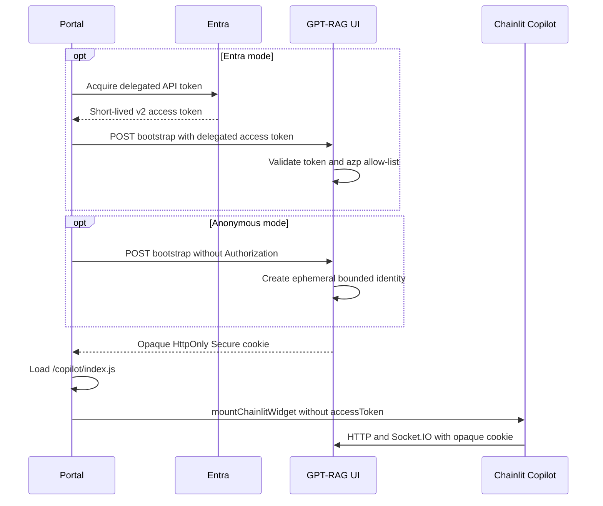

# Embed GPT-RAG with Chainlit Copilot

Chainlit Copilot can add GPT-RAG as a floating chat button and popover in a
portal. Embedding is off by default. When it is enabled,
`CHAINLIT_COPILOT_AUTH_MODE` must explicitly select `anonymous` or `entra`.
There is no default and an Entra failure never falls back to anonymous access.
The Copilot policy is separate from the standalone Chainlit OAuth and
`ALLOW_ANONYMOUS` policy.

Chainlit 2.9.4 mounts the widget in an open Shadow DOM in the portal document.
It does not use an iframe. GPT-RAG validates and supports only Chainlit's
built-in floating button and popover; other presentation modes are not
server-enforced and have not been validated.

## Security model

Both modes start at `POST {publicBase}/copilot/auth/bootstrap` and receive a
bounded, opaque `HttpOnly; Secure` cookie. In `anonymous` mode, the request must
not contain `Authorization`; GPT-RAG creates an ephemeral identity and stores no
Entra token. In `entra` mode, the portal sends one delegated Entra v2 access
token. GPT-RAG validates its signature, issuer, audience, tenant, scope,
`tid`, `oid`, `ver`, and authorized-party `azp` before retaining the token only
in bounded server memory. The cookie contains neither an Entra token nor a
Chainlit token.

The Chainlit widget is mounted without a raw Entra `accessToken`. Subsequent HTTP,
Socket.IO polling, Socket.IO upgrade, and WebSocket requests must carry the
opaque cookie. For a same-origin portal, the cookie is what distinguishes
Copilot traffic from standalone traffic under the configured public path.
Top-level citation navigation normally omits `Origin`; the dedicated download
endpoint resolves the cookie directly and repeats principal, conversation,
container, and path authorization. `Referer` is never trusted.



## Configure the UI

Add these keys to Azure App Configuration with the `gpt-rag-ui` or `gpt-rag`
label. Container environment variables with the same names take precedence.

| Key | Required | Description |
| --- | --- | --- |
| `CHAINLIT_COPILOT_ENABLED` | Yes | Set to `true` to enable embedding. Default: `false`. |
| `CHAINLIT_COPILOT_AUTH_MODE` | Yes | Required when embedding is enabled. The only values are `anonymous` and `entra`; there is no default. |
| `CHAINLIT_AUTH_SECRET` | Yes | Persistent secret used for Chainlit sessions and signed download grants. It must contain at least 32 UTF-8 bytes. Use a random value with at least 256 bits of entropy and store it through a Key Vault-backed App Configuration reference. Copilot startup fails rather than generating a temporary value. Replicas must share it and require end-to-end affinity; see the deployment limitation. |
| `CHAINLIT_URL` | Yes | Exact public HTTPS origin, for example `https://portal.contoso.com` or `https://chat.contoso.com`. It is an origin only; paths are rejected. |
| `CHAINLIT_ROOT_PATH` | When origins match | Optional canonical public path prefix, for example `/gpt-rag`. Use an empty value for an origin-root deployment. It must start with one `/`, must not end in `/`, and cannot contain dot segments, percent encoding, a query, or a fragment. A non-root path is required when a portal origin equals `CHAINLIT_URL`. |
| `CHAINLIT_ALLOWED_ORIGINS` | Yes | Comma-separated exact portal origins, with at most 20 explicit entries. A value may equal `CHAINLIT_URL` only when `CHAINLIT_ROOT_PATH` is non-empty. Wildcards, paths, credentials, `null`, and non-local HTTP origins are rejected. |
| `CHAINLIT_COOKIE_SAMESITE` | No | `lax` by default. Use `none` only when the portal and UI are cross-site. The Copilot cookie is always `Secure`. |
| `CHAINLIT_COPILOT_ENTRA_TENANT_ID` | Entra | Tenant GUID accepted in `tid` and the exact v2 issuer. |
| `CHAINLIT_COPILOT_ENTRA_AUDIENCE` | Entra | Exact API audience expected in `aud`. |
| `CHAINLIT_COPILOT_ENTRA_ALLOWED_CLIENT_IDS` | Entra | Comma-separated application (client) GUIDs authorized to bootstrap from the portal, with at most 50 entries. The v2 token's `azp` must match one value. Empty or malformed lists fail startup. Arbitrary portal clients are never accepted. |
| `CHAINLIT_COPILOT_ENTRA_REQUIRED_SCOPE` | No | Delegated scope required in `scp` for Entra mode. Default: `user_impersonation`. App-only tokens are rejected. |
| `CHAINLIT_COPILOT_SESSION_TTL_SECONDS` | No | Server-side session TTL from 60 to 86400 seconds. Default: 3600. Entra expiry can shorten it. |
| `CHAINLIT_COPILOT_MAX_SESSIONS` | No | Maximum in-memory Copilot sessions from 1 to 10000. Default: 1000. The least recently used session is evicted at capacity. |
| `CHAINLIT_COPILOT_BOOTSTRAP_RATE_LIMIT_PER_MINUTE` | No | Process-local bootstrap attempt limit per direct peer and exact origin, from 1 to 600. Default: 60. Returns `429` with `Retry-After`. This is defense in depth, not a replacement for trusted-ingress throttling. |
| `CITATION_SHARED_DOWNLOAD_CONTAINERS` | No | Comma-separated configured document or image containers whose contents have uniform access for every authorized UI user. Default: empty. Values must match `DOCUMENTS_STORAGE_CONTAINER` or `DOCUMENTS_IMAGES_STORAGE_CONTAINER`; this setting cannot introduce another container. The conversation-upload container remains conversation-bound. Never add permission-trimmed containers. |

`anonymous` Copilot mode is intentional and isolated. It does not use
`ALLOW_ANONYMOUS` as its authorization switch, disable OAuth, or convert any
standalone or Entra authentication failure into anonymous chat. `entra` mode
accepts v2 access tokens only and does not use the v1 `appid` claim. Invalid or
incomplete enabled configuration fails startup.

The standalone route policy remains independent. Existing OAuth or anonymous
standalone access continues to work. If neither is available, non-Copilot
requests fail with `503` while an explicitly configured Copilot mode can still
operate. When Copilot is disabled, standalone behavior is unchanged.
Enabling Copilot changes the process default for standalone anonymous access
to `false`; explicitly set `ALLOW_ANONYMOUS=true` if standalone anonymous
access must remain available without OAuth.
Standalone development can still generate a temporary `CHAINLIT_AUTH_SECRET`
when embedding is disabled.

Restart the UI after changing startup settings.
Rotating `CHAINLIT_AUTH_SECRET` also requires a restart and signs out current
users. Existing Chainlit tokens and one-hour citation grants signed with the
previous value stop validating.

In Entra mode, if both `ALLOWED_USER_PRINCIPALS` and `ALLOWED_USER_NAMES` are
empty, every valid delegated user from an allowed portal client in the
configured tenant is authorized. Treat that as an explicit deployment decision
and record security-owner sign-off.

## Public URL and reverse-proxy contract

The public base URL is the exact concatenation of `CHAINLIT_URL` and
`CHAINLIT_ROOT_PATH`. Prefer a same-origin path because it avoids third-party
cookie dependence:

```text
CHAINLIT_URL=https://portal.contoso.com
CHAINLIT_ROOT_PATH=/gpt-rag
CHAINLIT_ALLOWED_ORIGINS=https://portal.contoso.com
```

This produces `https://portal.contoso.com/gpt-rag`. The reverse proxy must send
the exact `/gpt-rag` prefix and every descendant to the GPT-RAG UI. It must not
strip the prefix and must not rely on `X-Forwarded-Prefix` to add it. Preserve
methods, query strings, request bodies, `Origin`, cookies, and `Set-Cookie`.
Support HTTP, Socket.IO polling and upgrades, and WebSocket upgrades on the same
prefix. Requests outside `/gpt-rag` remain portal routes. Requests that omit,
duplicate, percent-encode, or ambiguously rewrite the prefix fail closed.
Chainlit auth, OAuth-state, and Copilot session cookies are scoped to the
configured root. Changing from `/` to a non-root path signs users in again and
uses root-specific internal Chainlit cookie names so stale root cookies cannot
shadow the new session after a secret rotation. Signed legacy GPT-RAG cookies
using the current internal name are expired during the next auth lifecycle.

A sibling-subdomain deployment remains supported:

```text
CHAINLIT_URL=https://chat.contoso.com
CHAINLIT_ROOT_PATH=
CHAINLIT_ALLOWED_ORIGINS=https://portal.contoso.com
CHAINLIT_COOKIE_SAMESITE=none
```

Use exact CORS origins. Unrelated cross-site embedding is best effort because
browsers may block the required third-party cookie.

All public routes are beneath the public base:

| Purpose | Public path |
| --- | --- |
| Copilot bundle | `/copilot/index.js` |
| Bootstrap | `/copilot/auth/bootstrap` |
| Logout | `/copilot/auth/logout` |
| Widget settings and APIs | `/project/settings` and other authorized `/project/*` routes |
| Socket.IO polling and upgrade | `/ws/socket.io` |
| Static content | `/assets/*`, `/public/*`, and `/version-footer` |
| Authorized citation download | `/api/download/{grant_token}` |

Bootstrap is `POST` and returns
`{"success":true,"authMode":"anonymous|entra","expiresAt":<unix-seconds>}` plus
the path-scoped cookie. Logout is `POST`, returns `{"success":true}`, deletes
the bounded session, disconnects its active sockets, and clears that cookie.
The bundle, static content, settings, version footer, and downloads use `GET`;
Socket.IO uses its normal `GET`/`POST` polling and upgrade flow.

For the same-origin example, bootstrap is therefore
`https://portal.contoso.com/gpt-rag/copilot/auth/bootstrap`, Socket.IO is
`https://portal.contoso.com/gpt-rag/ws/socket.io`, and download grants start
with `https://portal.contoso.com/gpt-rag/api/download/`.

## Anonymous portal example

Anonymous mode must be deliberately configured:

```text
CHAINLIT_COPILOT_ENABLED=true
CHAINLIT_COPILOT_AUTH_MODE=anonymous
CHAINLIT_URL=https://portal.contoso.com
CHAINLIT_ROOT_PATH=/gpt-rag
CHAINLIT_ALLOWED_ORIGINS=https://portal.contoso.com
CHAINLIT_AUTH_SECRET=<Key Vault-backed secret with at least 32 bytes>
```

Bootstrap without an `Authorization` header, then mount without
`accessToken`. Supplying an authorization header is a configuration error and
returns `400`; it is never treated as anonymous fallback.

```html
<div id="gpt-rag-status" role="status">Loading assistant...</div>
<script>
  const chainlitServer = "https://portal.contoso.com/gpt-rag";

  async function startAnonymousAssistant() {
    const status = document.getElementById("gpt-rag-status");
    const bootstrap = await fetch(
      `${chainlitServer}/copilot/auth/bootstrap`,
      { method: "POST", credentials: "include" },
    );
    if (!bootstrap.ok) {
      status.textContent = "The assistant is unavailable.";
      return;
    }

    const script = document.createElement("script");
    script.src = `${chainlitServer}/copilot/index.js`;
    script.onload = () => {
      window.mountChainlitWidget({ chainlitServer, theme: "light" });
      status.hidden = true;
    };
    script.onerror = () => {
      status.textContent = "The assistant is unavailable.";
    };
    document.head.appendChild(script);
  }

  void startAnonymousAssistant();
</script>
```

Anonymous sessions support chat with an ephemeral identity. Durable thread
listing/recovery, user-bound uploads, feedback and other identity-bound routes,
and authenticated citation downloads are unavailable. Unauthorized citations
render as text rather than insecure links.

## Entra portal example

```text
CHAINLIT_COPILOT_ENABLED=true
CHAINLIT_COPILOT_AUTH_MODE=entra
CHAINLIT_URL=https://portal.contoso.com
CHAINLIT_ROOT_PATH=/gpt-rag
CHAINLIT_ALLOWED_ORIGINS=https://portal.contoso.com
CHAINLIT_AUTH_SECRET=<Key Vault-backed secret with at least 32 bytes>
CHAINLIT_COPILOT_ENTRA_TENANT_ID=11111111-1111-4111-8111-111111111111
CHAINLIT_COPILOT_ENTRA_AUDIENCE=api://22222222-2222-4222-8222-222222222222
CHAINLIT_COPILOT_ENTRA_ALLOWED_CLIENT_IDS=33333333-3333-4333-8333-333333333333
CHAINLIT_COPILOT_ENTRA_REQUIRED_SCOPE=user_impersonation
```

The allowed client ID is the portal app registration's application (client)
ID. Add more GUIDs as a comma-separated allow-list only when each portal is
authorized to bootstrap GPT-RAG. The API token must be a v2 token whose `azp`
matches that list; `appid`-only v1 tokens are rejected.

Acquire the API token through the portal's existing MSAL flow, bootstrap the
server session, and only then load and mount the widget.

```html
<div id="gpt-rag-status" role="status">Loading assistant...</div>
<script>
  const chainlitServer = "https://portal.contoso.com/gpt-rag";
  let sessionExpiryTimer;

  async function bootstrapAssistant(accessToken) {
    return fetch(`${chainlitServer}/copilot/auth/bootstrap`, {
      method: "POST",
      credentials: "include",
      headers: {
        Authorization: "Bearer " + accessToken,
      },
    });
  }

  function removeAssistantUi() {
    clearTimeout(sessionExpiryTimer);
    window.unmountChainlitWidget?.();
    document.getElementById("chainlit-copilot")?.remove();
    localStorage.removeItem("chainlit-copilot-thread-id");
  }

  async function clearServerSession() {
    await fetch(`${chainlitServer}/copilot/auth/logout`, {
      method: "POST",
      credentials: "include",
    });
  }

  async function stopAssistant() {
    // Remove stale content before waiting for a network request.
    removeAssistantUi();
    try {
      await clearServerSession();
    } catch {
      // The local UI is already gone. The bounded server session will expire.
    }
  }

  async function loadCopilotBundle() {
    if (typeof window.mountChainlitWidget === "function") return;
    await new Promise((resolve, reject) => {
      const script = document.createElement("script");
      script.src = `${chainlitServer}/copilot/index.js`;
      script.onload = resolve;
      script.onerror = reject;
      document.head.appendChild(script);
    });
  }

  async function verifySessionCookie() {
    return fetch(`${chainlitServer}/project/settings`, {
      method: "GET",
      credentials: "include",
    });
  }

  function scheduleRefresh(expiresAt) {
    const expiryMilliseconds = Number(expiresAt) * 1000;
    if (!Number.isFinite(expiryMilliseconds)) return;
    const refreshDelay = Math.max(
      0,
      expiryMilliseconds - Date.now() - 30_000,
    );
    sessionExpiryTimer = setTimeout(() => {
      void restartAssistant();
    }, refreshDelay);
  }

  async function startAssistant({ forceRefresh = false } = {}) {
    const status = document.getElementById("gpt-rag-status");
    let serverSessionCreated = false;
    status.hidden = false;
    status.textContent = "Loading assistant...";
    try {
      // portalAuth is the portal's own MSAL-backed token acquisition wrapper.
      const token = await portalAuth.getGptRagAccessToken({ forceRefresh });
      let response = await bootstrapAssistant(token);

      if (response.status === 401) {
        const refreshed = await portalAuth.getGptRagAccessToken({ forceRefresh: true });
        response = await bootstrapAssistant(refreshed);
      }
      if (response.status === 403) {
        status.textContent =
          "You do not have access to this assistant. Contact your administrator.";
        return;
      }
      if (response.status === 429) {
        status.textContent = "Too many attempts. Try again shortly.";
        return;
      }
      if (response.status === 401) {
        status.textContent = "Your session expired. Sign in again.";
        return;
      }
      if (!response.ok) {
        status.textContent = "The assistant is temporarily unavailable. Try again.";
        return;
      }

      const session = await response.json();
      serverSessionCreated = true;
      const probe = await verifySessionCookie();
      if (!probe.ok) {
        throw new Error("The browser did not establish the assistant cookie.");
      }

      await loadCopilotBundle();
      if (typeof window.mountChainlitWidget !== "function") {
        throw new Error("The Chainlit Copilot bundle did not initialize.");
      }
      window.mountChainlitWidget({
        chainlitServer,
        theme: "light",
      });
      scheduleRefresh(session.expiresAt);
      status.hidden = true;
    } catch {
      // If bootstrap succeeded but probe, bundle loading, or mounting failed,
      // remove local state first and then revoke the server session.
      removeAssistantUi();
      if (serverSessionCreated) {
        try {
          await clearServerSession();
        } catch {}
      }
      status.hidden = false;
      status.textContent = "The assistant is temporarily unavailable. Try again.";
    }
  }

  async function restartAssistant() {
    await stopAssistant();
    await startAssistant({ forceRefresh: true });
  }

  startAssistant();
</script>
```

An origin rejection is an operator configuration error. A portal whose origin
is not allow-listed normally sees a browser CORS/network error rather than a
readable `403`; a configured origin can read a `403` authorization denial. Do
not retry either case as a sign-in failure, and never mount an anonymous widget
after bootstrap fails.
The UI emits `429` with `Retry-After` when its process-local bootstrap limit is
reached. Honor that delay. Configure authoritative distributed throttling at
Front Door WAF, API Management, or another trusted gateway because clients can
change source paths and requests can be spread across replicas.

If the second `401` remains after the one forced token refresh, the refreshed
credential still did not establish an acceptable delegated session. Stop the
loop and require an explicit sign-in. If bootstrap succeeds but the widget's
first authenticated request fails, investigate cookie delivery separately;
cross-site cookie blocking is not fixed by refreshing the Entra token.
The sample probes `/project/settings` because a bootstrap `200` confirms that
the server emitted `Set-Cookie`, not that the browser accepted it.

### Mid-session expiry

Use bootstrap's Unix-seconds `expiresAt` value to refresh before expected
expiry. The opaque session can also disappear because its configured TTL or the Entra token
expires, because bounded state evicts an inactive session, or because the UI
process restarts. The portal should treat an HTTP `401`, Socket.IO
authentication failure, or WebSocket `4401` as a signed-out assistant:

1. Unmount and remove the current widget.
2. Remove `chainlit-copilot-thread-id`.
3. Show a visible message such as "Your assistant session expired. Reconnecting..."
4. In Entra mode, acquire a fresh token; in anonymous mode, send no token.
   Call bootstrap once.
5. Mount a fresh widget only after bootstrap succeeds.

Do not reconnect indefinitely. After one failed refresh, show a sign-in action
or the appropriate access/unavailable message.

Chainlit 2.9.4 exposes no reliable host callback for every Socket.IO loss,
eviction, or affinity failure. Proactive `expiresAt` refresh covers planned
expiry only. Qualify any automatic-recovery claim, and make the widget's own
authentication failure visible when the host cannot observe it.

## Logout and account switching

The portal owns the complete widget lifecycle. Chainlit 2.9.4 does not fully
remove local widget state through its convenience globals, so clean it up
explicitly.

```js
async function stopAssistant() {
  if (typeof sessionExpiryTimer !== "undefined") {
    clearTimeout(sessionExpiryTimer);
  }
  window.unmountChainlitWidget?.();
  document.getElementById("chainlit-copilot")?.remove();
  localStorage.removeItem("chainlit-copilot-thread-id");
  try {
    await fetch(`${chainlitServer}/copilot/auth/logout`, {
      method: "POST",
      credentials: "include",
    });
  } catch {}
}
```

Unmounting tears down the widget's Socket.IO connection. On portal logout,
call `stopAssistant` and remain signed out. In Entra mode, on account change:

1. Stop and remove the old widget.
2. Clear the old server session and local thread ID.
3. Acquire a token for the new account.
4. Bootstrap again.
5. Mount a fresh widget.

A successful bootstrap replaces any existing Copilot server session and
triggers disconnection of its tracked transports, so a different account
cannot inherit the previous principal's state. A malformed token or temporary
JWKS failure does not destroy an otherwise valid current session. An explicit
logout or an authorization denial clears it.

Skipping the stop-and-clear sequence is not cosmetic: it can leave the old
account's locally rendered thread visible. Treat a widget that shows the wrong
account as a security incident, stop it immediately, and do not let the user
send another message until a clean bootstrap succeeds. The server rejects
Socket.IO restoration when the authenticated principal or opaque Copilot
session does not match the existing Chainlit session.

All tabs on the same browser profile share the UI cookie, and portal tabs on
the same origin also share `chainlit-copilot-thread-id`. A successful bootstrap
in one tab replaces the server session and disconnects the other tabs. Do not
support concurrent accounts in separate tabs. Coordinate lifecycle changes
with `BroadcastChannel` or an equivalent portal-owned mechanism if multiple
tabs are expected.

The UI admits at most four concurrent physical Socket.IO transports per opaque
Copilot session. This fixed safety bound is not configurable. Restoring an
already-connected logical Chainlit session replaces its existing transport:
the existing transport is disconnected before restoration continues, and the
replacement is rejected if disconnection fails. Logout, session expiry,
bounded-state eviction, a successful account-switch bootstrap, and
same-principal session replacement invalidate all tracked transports, trigger
their disconnection, and cancel associated active Chainlit tasks.

## Portal Content Security Policy

The portal's CSP governs the widget because the Shadow DOM is part of the
portal document. CSP returned by the GPT-RAG UI does not govern the portal.

- `script-src` must permit the GPT-RAG UI origin.
- `connect-src` must permit the UI HTTPS and WSS origins.
- `style-src 'unsafe-inline'` is required by Chainlit 2.9.4 for styles injected
  into the Shadow DOM.
- If no custom font is configured, the bundle loads Google Inter. Permit the
  required Google style/font origins or configure an approved self-hosted font.
- `frame-src` is not required for this widget.

Account switching injects the external bundle again. With a nonce-based portal
CSP, the newly created script element must receive a fresh valid nonce just as
it did on the initial load.

## Exact-origin, path, and download behavior

- Portal browser traffic is accepted only from exact
  `CHAINLIT_ALLOWED_ORIGINS` values, with at most 20 configured origins.
  Same-origin traffic is separated by the exact `CHAINLIT_ROOT_PATH`, explicit
  Copilot routes, and the opaque Copilot cookie. A request with no Copilot
  cookie remains on the standalone policy.
- The public origin comes from `CHAINLIT_URL`; the optional public prefix comes
  only from `CHAINLIT_ROOT_PATH`. Neither setting is inferred from forwarding
  headers.
- Requests with an unlisted `Origin` are rejected before Chainlit handles
  them. A valid Copilot cookie binds the request to the Copilot policy. The
  dedicated top-level download route also accepts a no-`Origin` navigation,
  resolves the opaque Copilot or existing standalone Chainlit cookie, and then
  repeats every download authorization check. If both cookies are present, the
  identity matching the signed grant is selected. `Referer` is ignored.
- `/auth/jwt`, `/auth/header`, `/auth/oauth/*`, and `/logout` are unavailable
  to a Copilot session. The portal uses only the dedicated bootstrap and
  Copilot logout endpoints.
- Citation URLs are absolute URLs on `CHAINLIT_URL` plus
  `CHAINLIT_ROOT_PATH`. They contain a short-lived,
  signed grant bound to the authenticated principal, conversation, container,
  and blob. The server rechecks the session and conversation ownership before
  streaming the blob in chunks. Grants expire after 3,600 seconds and secret
  rotation invalidates them. Conversation IDs must be canonical UUIDs. Blob grant
  targets containing residual percent escapes are rejected to prevent multi-stage
  URL decoding; such blob names must be renamed before they can be linked.
  Conversation uploads must be under
  `conversations/<owned-conversation-id>/`. Other containers are default-denied
  unless the configured document or image container is explicitly listed in
  `CITATION_SHARED_DOWNLOAD_CONTAINERS`, which is safe only for corpora with
  uniform access for every authorized UI user. Listing another container name
  has no effect, and the conversation-upload container always remains
  conversation-bound.
  Permission-trimmed containers require a future document-level authorization
  integration and must not be listed. Unauthorized citations render as text
  without a link. Direct SAS and public-blob fallbacks are not used.
- Entra users are identified as `tid:oid`. Tokens without both claims are rejected,
  and thread ownership is checked before list/get/resume/rename/delete,
  feedback, and download operations.
- Prefer lowercase `tid:oid` values in `ALLOWED_USER_PRINCIPALS`. Bare `oid`
  entries remain accepted for compatibility with the orchestrator's existing
  allow-list contract.
- Chainlit users and thread authors are bound to `tid:oid`. The current
  orchestrator conversation endpoints are bearer-token scoped but persist a
  bare `oid`; GPT-RAG canonicalizes the Chainlit owner with the validated
  token's `tid` and rejects conflicting tenants. A future multi-tenant
  orchestrator must persist `tid:oid` before this compatibility path can be
  removed.

## Browser bridge restrictions

Copilot sessions default-deny Chainlit `call_fn` and `window_message` in both
directions. Do not send credentials, tokens, customer data, or authorization
decisions through browser bridge features.

Chainlit 2.9.4 still exposes browser globals such as
`mountChainlitWidget`, `unmountChainlitWidget`, `toggleChainlitCopilot`,
`sendChainlitMessage`, thread access helpers, the shadow-root reference, and
theme state. Any script already running in the portal can call these globals;
they are convenience APIs, not authorization boundaries.

The pinned bundle also contains non-configurable
`window.parent.postMessage(..., "*")` behavior for `window_message`, and
dispatches `chainlit-call-fn` on `window` when `call_fn` is used. GPT-RAG blocks
those server events for Copilot sessions, but the wildcard/browser-global code
remains present in the third-party bundle. Reassess this limitation when
upgrading Chainlit.

## Deployment limitation

The bounded Copilot session state and, in Entra mode, retained token state are
process-local.

- One UI replica is the supported safe default.
- Multiple replicas require session affinity covering bootstrap, HTTP,
  Socket.IO polling, Socket.IO upgrade, and WebSocket traffic.
- Restart, revision replacement, node loss, eviction, or affinity loss signs
  affected users out.
- Affinity is not high availability. Resilient scale-out requires a shared,
  encrypted server-side session store in a future change.

This repository does not enforce replica counts. For Azure Container Apps, use
single-revision mode, keep both minimum and maximum UI replicas at `1` for that
revision, and do not split traffic across revisions. `minReplicas=1` and
`maxReplicas=1` apply per revision and are not sufficient when multiple
revisions receive traffic. A revision switch still loses process-local sessions
and signs users out. If scaling out, verify affinity for every path listed above
instead of assuming gateway cookie affinity also pins the backend replica. Also
verify that `CHAINLIT_URL` plus `CHAINLIT_ROOT_PATH` is the externally visible
public base after gateway/proxy routing; it is used to mint absolute citation
URLs.

Prefer publishing the portal and UI through the approved Zero Trust gateway or
front door. Do not expose the Container App directly.

The bootstrap limiter is also process-local and keys a fixed 60-second window
by a SHA-256 digest of the direct peer plus exact `Origin`. It retains only a
bounded number of digests. Peer identity is meaningful only when the UI is
reached through a trusted ingress; do not trust client-supplied forwarding
headers in the application. Behind an ingress, many users can share one direct
peer bucket, so tune the local limit for aggregate bursts. Enforce authoritative
per-user or per-client rate limits at that ingress.

## Troubleshooting

| Symptom | Check |
| --- | --- |
| Bootstrap 400 in anonymous mode | Remove the `Authorization` header. Anonymous mode never consumes or falls back from a token. |
| Bootstrap 403 | The browser `Origin` exactly matches `CHAINLIT_ALLOWED_ORIGINS`. In Entra mode also check user policy and that v2 `azp` is in `CHAINLIT_COPILOT_ENTRA_ALLOWED_CLIENT_IDS`. |
| Bootstrap appears as a CORS/network error | The portal origin is not listed, is malformed, or the request bypassed the approved ingress. Unlisted origins cannot read the UI's `403`. |
| Bootstrap 401 in Entra mode | Token version, issuer, audience, tenant, `tid`, `oid`, delegated scope, signature, and expiry. Reacquire once. |
| Bootstrap 429 | Honor `Retry-After`, stop automatic retries, and inspect trusted-ingress limits if the condition persists. |
| Bootstrap 503 | Entra JWKS could not be reached. Show the unavailable state; do not start a sign-in loop. |
| Widget reports authentication failure | Bootstrap completed before mounting and the request used `credentials: "include"`. |
| Cookie absent after successful bootstrap | HTTPS is used; for cross-site portals use `SameSite=None`; check browser third-party-cookie policy. This is distinct from token verification failure. |
| Same-origin path returns 404 | The proxy preserves the exact `CHAINLIT_ROOT_PATH` instead of stripping it or relying on `X-Forwarded-Prefix`. |
| CSP blocks the widget | Portal `script-src`, `connect-src`, `style-src`, and font rules include the required sources. |
| Socket.IO 403 or WebSocket 1008/4401 | Exact origin, cookie delivery, session affinity, and server session expiry. |
| Citation returns 404 | Session is current, the conversation belongs to the user, the signed grant is unmodified, and the blob exists. |
| Account switch shows an old thread | Call Copilot logout, unmount, remove `#chainlit-copilot`, and remove `chainlit-copilot-thread-id` before bootstrap. |
| Widget shows the wrong account | Stop the widget immediately, clear it as above, and bootstrap again. Do not allow another send while stale account content is visible. |

## Residual Chainlit 2.9.4 limitations

- The standalone page continues to use Chainlit's built-in OAuth and session
  mechanism. The bounded opaque-cookie store described here applies only to
  Copilot sessions.
- Socket and browser bridge guards patch pinned Chainlit 2.9.4 internals because
  that release has no supported policy hook for them. Revalidate all guards
  before upgrading Chainlit.
- Browser globals, the open Shadow DOM reference, and the wildcard
  `postMessage` code remain present in the downloaded third-party bundle even
  though GPT-RAG blocks the corresponding server bridge events.
- Cross-site operation still depends on the target browser accepting the
  `SameSite=None; Secure` cookie. There is no safe application fallback when
  third-party cookies are blocked.
- Anonymous mode intentionally has no durable user identity, thread recovery,
  user-bound upload, or authenticated citation-download support.
- One browser profile and portal origin cannot maintain independent Copilot
  accounts across tabs because the opaque cookie and thread key are shared.
- Shared citation containers are all-or-nothing. Leave them unlisted to render
  citations as plain text unless every authorized UI user may download every
  blob in the container.
